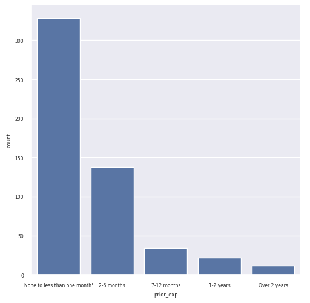
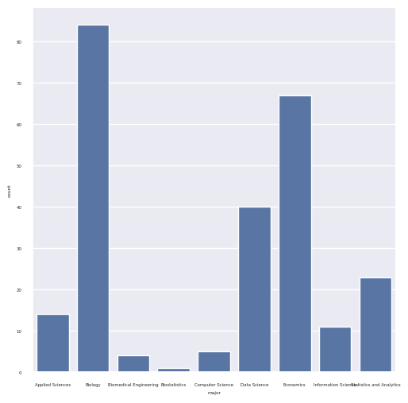
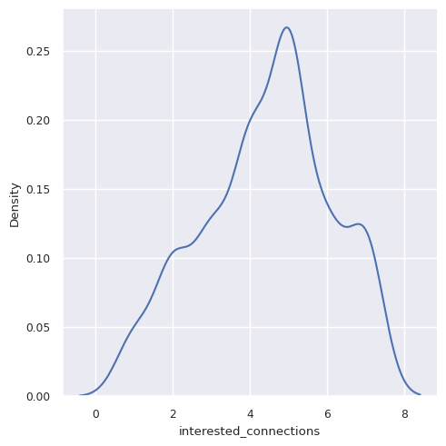

---
# Do not edit the text between these lines!
layout: default
---

# Lucy Yan's EX09 Website!
## Analysis and Visualizations
For my analysis, I decided to see if the data collected from the class survey supports the change of teaching more about applied programming in data in COMP110. The first things I did was turn the CSV file of data into a table, changed it to be column oriented, and selected the columns of data I wanted to use. I chose the "major," "prior_exp," and "interested_connections" variables. I then counted the frequency of responses for the "prior_exp" variable and made a bar chart. This shows the distribution of experience students in COMP110 have with programming.

I then made another bar chart counting the responses to the "major" variable. I chose to only plot a few of the majors that dealt with data the most and potentially used the most applications in programming.

Finally, I converted the responses of the "interested_connections" to int data types and made a density plot to show the distribution of answers to how interested students were with the connection between computer science and other fields.

## Conclusion

I think that my data analysis does generally support my idea. The first chart the majority of students don't have much experience in programming. This means that COMP110 is the introduction to programming for many students. The second chart clearly shows that there are many students' primary majors that are not purely computer science. This implies that a lot of students are going into fields that utilize programming as a tool in their jobs, such as wrangling data. Finally, the last chart shows that the central tendency to the "interested_connections" variable is around 5. This means that students are moderately interested with the connections between computer science and other fields. These analyses show that most students don't have programming experience, there are many major backgrounds to students in COMP110, and these majors mostly don't require further programming courses. Students are also interested in connecting computer to other fields, so I recommend that COMP110 should integrate more data oriented material, such as this assigment, into the course. An extension to this includes providing other data sets that students can analyze. A potential cost is that the instructional team will have to find data sets to use, and they need to spend time to slightly change the curriculum and assignments. 

<!-- This is a comment. Below, you'll see code for inserting an image. To make this image appear, update <custom-path>. To add an image, save it inside the imgs folder of this repository. -->